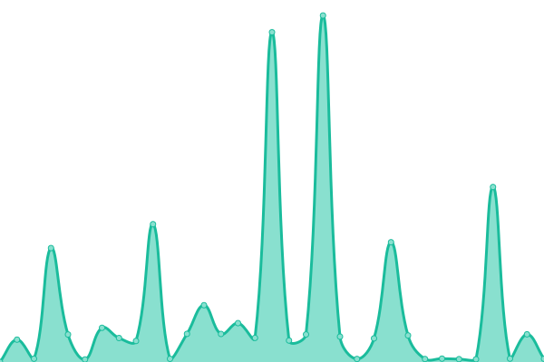

# [📈 Live Status](https://demo.upptime.js.org): <!--live status--> **🟩 All systems operational**

<!-- Trigger workflows -->

This repository contains the open-source uptime monitor and status page for [vietnv1995](https://demo.upptime.js.org), powered by [Upptime](https://github.com/upptime/upptime).

With [Upptime](https://upptime.js.org), you can get your own unlimited and free uptime monitor and status page, powered entirely by a GitHub repository. We use [Issues](https://github.com/vietnv1995/upptime/issues) as incident reports, [Actions](https://github.com/vietnv1995/upptime/actions) as uptime monitors, and [Pages](https://demo.upptime.js.org) for the status page.

<!--start: status pages-->
<!-- This summary is generated by Upptime (https://github.com/upptime/upptime) -->
<!-- Do not edit this manually, your changes will be overwritten -->
<!-- prettier-ignore -->
| URL | Status | History | Response Time | Uptime |
| --- | ------ | ------- | ------------- | ------ |
|  [API EZMatch Check HasFace](https://faceapi.mobidev.asia) | 🟩 Up | [api-ez-match-check-has-face.yml](https://github.com/vietnv1995/upptime/commits/HEAD/history/api-ez-match-check-has-face.yml) | 

 3788ms
     
 | 

<a href="https://vietnv1995.github.io/upptime/history/api-ez-match-check-has-face">96.94%</a>
    

|  [API Easy3P Main](https://api.easy3p.com) | 🟩 Up | [api-easy3-p-main.yml](https://github.com/vietnv1995/upptime/commits/HEAD/history/api-easy3-p-main.yml) | 

 267ms
     
 | 

<a href="https://vietnv1995.github.io/upptime/history/api-easy3-p-main">100.00%</a>
    

<!--end: status pages-->

[**Visit our status website →**](https://demo.upptime.js.org)

## 📄 License

- Powered by: [Upptime](https://github.com/upptime/upptime)
- Code: [MIT](./LICENSE) © [Anand Chowdhary](https://anandchowdhary.com), supported by [Pabio](https://pabio.com)
- Data in the `./history` directory: [Open Database License](https://opendatacommons.org/licenses/odbl/1-0/)
